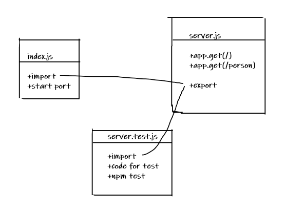

# basic-express-server

* [Heroku Link](https://mahmoud-basic-express-server.herokuapp.com/)

* [Actions report](https://github.com/Mahmoud-Khader/basic-express-server/actions)

### Setup
`.env` requirements
* ` PORT` -3000


### Running the app

* `npm start`
* Endpoint: `person?name=Username`

```
{
    "name":"UsedName"
}

```

### Tests

Unit Tests: `npm run test`
Lint Tests: `npm run lint UML`

### diagram 

